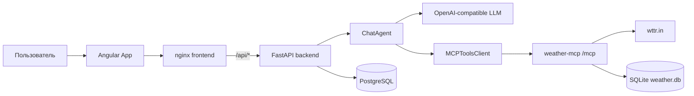

# Архитектура

## Компонентная схема

## Frontend и reverse proxy

`frontend/src/main.ts` запускает standalone `App`. `frontend/nginx.conf` раздаёт статические файлы, перенаправляет `/api/` на `http://backend:8000` и имеет локальный `GET /health`. nginx не проксирует `/health` frontend в FastAPI.

## FastAPI backend

`backend/app/main.py` создаёт `FastAPI(title="mcp-ai API", version="0.1.0")`, подключает `CORSMiddleware` и реализует HTTP endpoints. Dependency functions `get_db`, `get_mcp_client` и `get_llm_client` создают зависимости endpoint.

Backend не разделён на router, repository и service-каталоги: API handlers, persistence-вызовы и orchestration находятся в модулях `backend/app/`.

## LLM boundary

`OpenAICompatibleClient` из `backend/app/llm_client.py` — единственная интеграция с моделью. Provider определяется `LLM_BASE_URL`, а model — `LLM_MODEL`; код не содержит provider-specific adapter classes. DeepSeek приведён только как пример в `.env.example` и README.

## MCP boundary

`MCPToolsClient` из `backend/app/mcp_client.py` использует `mcp.client.streamable_http.streamable_http_client` и `ClientSession`. Конфигурация содержит единственный URL `MCP_SERVER_URL`, поэтому приложение не поддерживает registry нескольких server URLs.

`weather-mcp` — отдельный процесс на MCP 2.2. Он владеет внешним HTTP-клиентом `WttrWeatherClient`, SQLite и `WeatherScheduler`.

## Persistence

### PostgreSQL

SQLAlchemy engine из `backend/app/database.py` использует `DATABASE_URL` и `pool_pre_ping=True`. Alembic создаёт `chat_sessions`, `chat_messages`, enum `message_role` и JSONB `mcp_data`.

### SQLite

`WeatherRepository` из `weather-mcp/weather_mcp/persistence.py` создаёт SQLite tables самостоятельно. Weather SQLite не управляется Alembic и не используется backend для чатов.

## Container topology

Compose запускает `db` и `weather-mcp` параллельно. `backend` ждёт их healthchecks; `frontend` ждёт healthcheck `backend`. Явная compose network не описана, поэтому используется default network Compose.

## Границы ответственности

| Компонент | Ответственность |
| --- | --- |
| `App` | UI сессий, сообщений, MCP status и вызов API |
| nginx | Static SPA и reverse proxy `/api/` |
| `main.py` | HTTP validation, persistence и HTTP error mapping |
| `ChatAgent` | LLM/MCP orchestration в рамках одного сообщения |
| `MCPToolsClient` | MCP transport, discovery и нормализация protocol response |
| `weather-mcp` | Weather tools, provider access, schedules и weather SQLite |
| PostgreSQL | Persisted chat history и MCP metadata |
