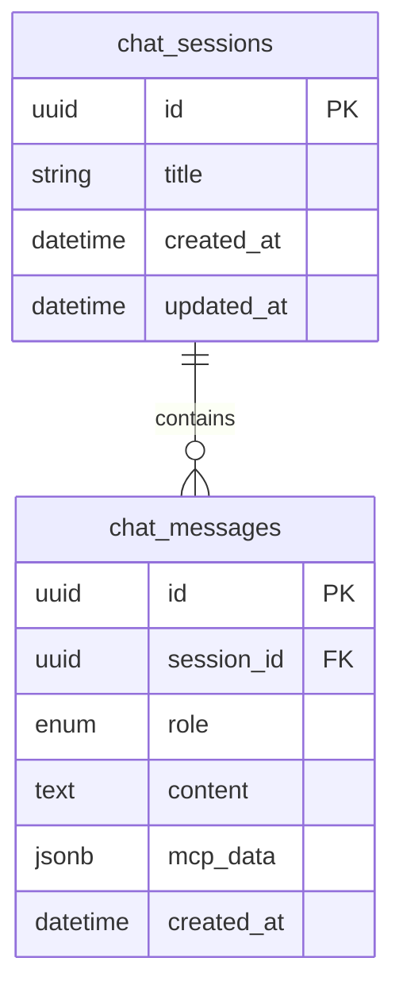

# База данных

## Обзор хранилищ

`mcp-ai` использует две независимые БД. PostgreSQL хранит чат через SQLAlchemy/Alembic. SQLite хранит данные Weather MCP через стандартный `sqlite3`; SQLite schema не входит в Alembic migration.

## PostgreSQL

### Подключение

`backend/app/database.py` создаёт `engine = create_engine(get_settings().database_url, pool_pre_ping=True)`. `SessionLocal` — SQLAlchemy `sessionmaker`, `expire_on_commit=False`. `get_db()` предоставляет `Session` endpoint handlers.

### Alembic

`backend/alembic/env.py` подставляет `Settings.database_url` в Alembic config и импортирует `Base.metadata`. Единственная migration `backend/alembic/versions/20260921_01_create_chat_tables.py` с revision `20260921_01` создаёт существующую schema.

## SQLAlchemy models

### `MessageRole`

**Исходник:** `backend/app/models.py`. Python enum со значениями `user`, `assistant`, `system`. PostgreSQL enum называется `message_role`.

### `ChatSession`

**Таблица:** `chat_sessions`. **Исходник:** `backend/app/models.py`, класс `ChatSession`.

| Поле | Тип | Ограничения и назначение |
| --- | --- | --- |
| `id` | PostgreSQL UUID | Primary key, Python default `uuid.uuid4` |
| `title` | `String(160)` | Not null, UI title сессии |
| `created_at` | `DateTime(timezone=True)` | Not null, server default `func.now()` |
| `updated_at` | `DateTime(timezone=True)` | Not null, server default/on update `func.now()` |

`messages` — relationship к `ChatMessage`, `back_populates="session"`, cascade `all, delete-orphan`. Порядок relationship: `(ChatMessage.created_at, ChatMessage.role.asc())`.

### `ChatMessage`

**Таблица:** `chat_messages`. **Исходник:** `backend/app/models.py`, класс `ChatMessage`.

| Поле | Тип | Ограничения и назначение |
| --- | --- | --- |
| `id` | PostgreSQL UUID | Primary key, Python default `uuid.uuid4` |
| `session_id` | PostgreSQL UUID | Not null FK `chat_sessions.id`, `ON DELETE CASCADE`, indexed |
| `role` | enum `message_role` | Not null: `user`, `assistant`, `system` |
| `content` | `Text` | Not null, message text |
| `mcp_data` | PostgreSQL `JSONB` | Nullable technical MCP metadata |
| `created_at` | `DateTime(timezone=True)` | Not null, server default `func.now()` |

`session` — обратная relationship к `ChatSession.messages`.

### Индексы

Migration создаёт `ix_chat_messages_session_id` для `chat_messages.session_id`. `ChatSession.id` и `ChatMessage.id` имеют PK indexes. Явных JSONB indexes нет.

## ER diagram

## `mcp_data` JSONB

`POST /messages` сохраняет `status`, `server_url`, `available_tools` и `tool_calls`. Каждый tool call record имеет `id`, `name`, parsed `arguments`, normalized `result`, `error`, `duration_ms`. Error exchange также содержит `error_category`. Legacy `/tools/list` сохраняет `tools` вместо `available_tools`.

## SQLite Weather MCP

### Подключение и схема

`WeatherRepository` в `weather-mcp/weather_mcp/persistence.py` открывает `sqlite3.connect(database_path)`, задаёт `row_factory=sqlite3.Row` и вызывает `_initialize()`. При non-memory path родительская директория создаётся автоматически.

### `weather_schedules`

| Поле | SQLite тип | Назначение |
| --- | --- | --- |
| `schedule_id` | `TEXT PRIMARY KEY` | UUID string расписания |
| `city` | `TEXT NOT NULL` | Исходный нормализованный city input |
| `interval_seconds` | `INTEGER NOT NULL` | Interval APScheduler |
| `active` | `INTEGER NOT NULL` | Boolean flag |
| `created_at` | `TEXT NOT NULL` | UTC ISO-8601 timestamp |
| `last_run_at` | `TEXT` | Последний запуск или null |
| `next_run_at` | `TEXT` | Следующий запуск или null |

Partial unique index `active_weather_schedule_by_city_interval` уникален только для `active = 1` и пары `(city, interval_seconds)`.

### `weather_samples`

| Поле | SQLite тип | Назначение |
| --- | --- | --- |
| `sample_id` | `INTEGER PRIMARY KEY AUTOINCREMENT` | Surrogate key |
| `city`, `collected_at` | `TEXT NOT NULL` | Ключ выборки истории |
| `temperature_c` | `REAL NOT NULL` | Температура |
| `relative_humidity_percent` | `INTEGER NOT NULL` | Legacy обязательная влажность |
| `wind_speed_kmh` | `REAL NOT NULL` | Скорость ветра |
| extended fields | nullable | feels-like, humidity, pressure, precipitation, cloud, visibility, condition |

Index `weather_samples_by_city_collected_at` используется `samples_since(...)`. `_migrate_weather_samples()` additive-мигрирует nullable columns и backfill-ит `humidity_percent` из legacy column. Versioned migration system для SQLite отсутствует.

## Persistence boundaries

Chat API не читает и не пишет SQLite. Weather server не читает PostgreSQL. Compose монтирует PostgreSQL volume `mcp-ai-postgres-data` и SQLite volume `mcp-ai-weather-mcp-data` отдельно.
