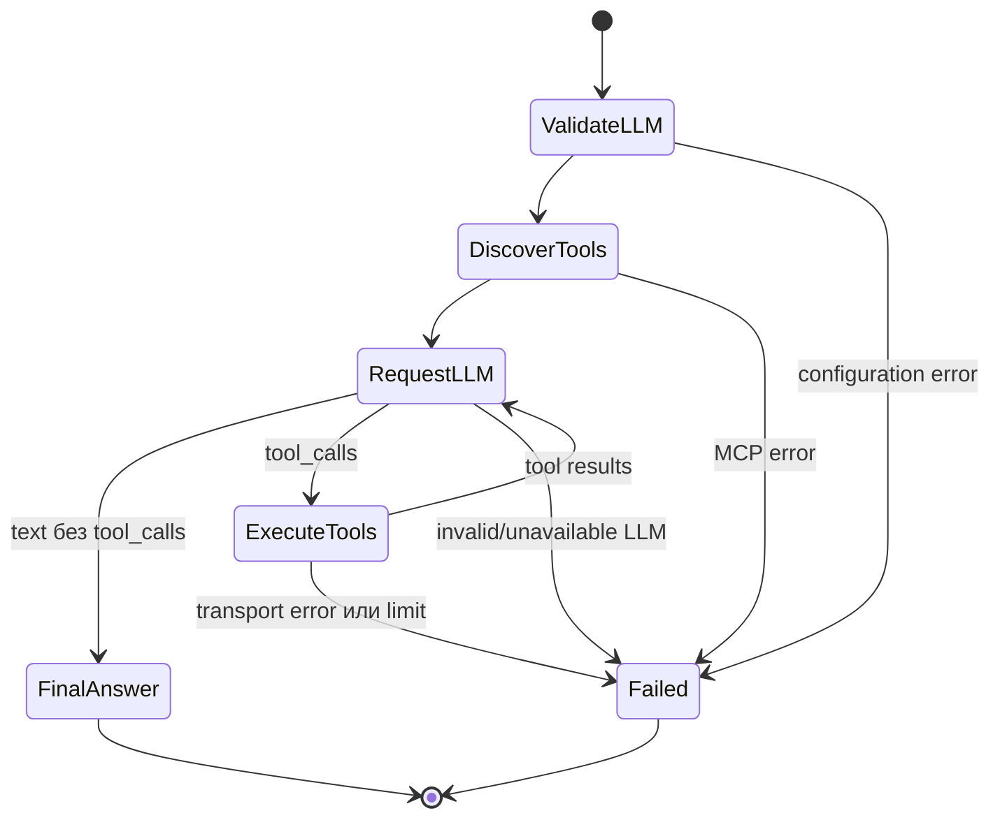

# State machine агента

## Наличие state machine

Полноценная state machine в текущей версии проекта отсутствует. Нет enum состояний workflow, transition table, persistent task state, state validation layer или отдельного executor.

## Реально используемый механизм

`ChatAgent.run(...)` из `backend/app/agent.py` реализует неявный линейный цикл. Его состояния существуют как локальная последовательность выполнения:

## Переходы

### `ValidateLLM`

`ensure_configured()` проверяет required environment variables. Failure преобразуется в `AgentExecutionError(category="llm_configuration")`.

### `DiscoverTools`

Открывается MCP context и вызывается `list_tools()`. `MCPTimeoutError` даёт category `mcp_timeout`; другие `MCPClientError` — `mcp_unavailable`.

### `RequestLLM`

`OpenAICompatibleClient.complete(...)` возвращает assistant text/tool calls. Пустой text без tool calls нарушает инвариант final response и приводит к `llm_invalid_response`.

### `ExecuteTools`

Arguments парсятся, name проверяется против `allowed_tools`, result record добавляется в memory. Error result tool не считается fatal transition: он передаётся LLM как `tool` message.

### `FinalAnswer`

Непустой `content.strip()` без requested calls возвращает `AgentResult`. API сохраняет его в PostgreSQL.

## Инварианты и ограничение

Tool name должен быть current discovered name. Tool arguments должны быть JSON object; некорректные arguments не вызывают MCP. Общее число calls не может превышать `MAX_TOOL_CALLS`. Эта проверка применяется до запуска нового batch.

## Persistence и error state

Внутреннее состояние state machine не persistent. Только финальный outcome хранится как `ChatMessage` и `mcp_data`: successful result/tool records либо error category/error records. После restart незавершённый agent workflow не восстанавливается.
