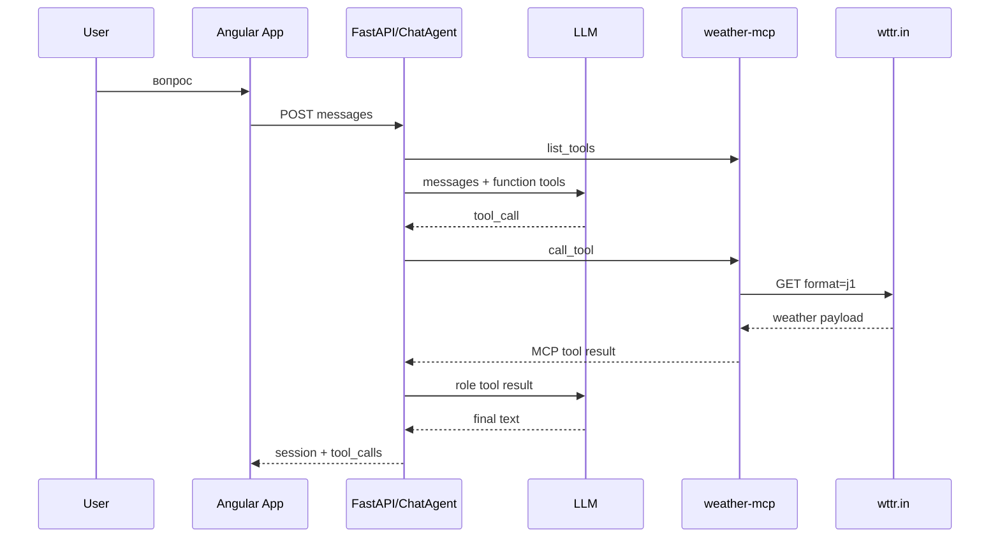

# Потоки данных

## Обычный LLM запрос

1. `App.sendMessage()` вызывает `ApiService.sendMessage(...)`.
2. nginx проксирует `/api/sessions/{id}/messages` в FastAPI.
3. `send_agent_message(...)` загружает `ChatSession` и её history PostgreSQL.
4. `ChatAgent` всё равно открывает MCP session и выполняет tool discovery до LLM call.
5. LLM возвращает text без `tool_calls`.
6. `_save_exchange(...)` сохраняет user/assistant messages в PostgreSQL.
7. Angular получает `AgentMessageResponse` и отображает persisted session.

## Запрос с MCP tool

## Запрос с несколькими MCP tools

1. LLM response может включить несколько tool calls.
2. `ChatAgent` проверяет, что весь batch укладывается в remaining `MAX_TOOL_CALLS`.
3. Agent выполняет calls последовательно через одну `ConnectedMCPTools` session и после каждого добавляет tool message.
4. Следующий LLM request получает results всех calls.
5. LLM может запросить ещё calls или final text. Backend не объединяет tool results самостоятельно.

## Weather request

1. LLM выбирает weather tool из discovery schema.
2. `MCPToolsClient.call_tool(...)` передаёт name и JSON object arguments `/mcp`.
3. `WeatherService` вызывает `WttrWeatherClient`.
4. `WttrWeatherClient` URL-encodes city, запрашивает wttr.in `format=j1` и преобразует provider errors в `ToolError`.
5. `WeatherService` normalizes provider payload to Pydantic result.
6. MCP normalized result возвращается agent и затем LLM.

## Scheduler request

1. LLM выбирает `create_weather_schedule` с city/interval.
2. `WeatherScheduler.create_schedule(...)` сохраняет `WeatherSchedule` SQLite.
3. При новом schedule `_register(...)` добавляет APScheduler interval job.
4. В scheduled run `_run_schedule(...)` updates timestamps, получает current weather и сохраняет `WeatherSample`.
5. Позже `get_weather_summary(...)` читает city/range samples из SQLite и агрегирует metrics.

## Conversation persistence

1. API handler получает final `AgentResult` или `AgentExecutionError`.
2. `_save_exchange(...)` append-ит `ChatMessage(role=user)` и `ChatMessage(role=assistant, mcp_data=...)`.
3. Один SQLAlchemy commit сохраняет exchange, session `updated_at` и first-message title change.
4. `GET /api/sessions/{id}` возвращает history; `App` визуализирует message content/tool records.

## Application startup

1. Compose starts `db` и `weather-mcp`.
2. Weather lifespan создаёт SQLite repository, weather HTTP client и `WeatherScheduler`; scheduler восстанавливает active schedules.
3. После healthchecks backend запускает Alembic migration и uvicorn.
4. Backend `/health` становится healthy при доступной PostgreSQL, независимо от LLM config.
5. Frontend nginx starts после healthy backend и раздаёт Angular build.
